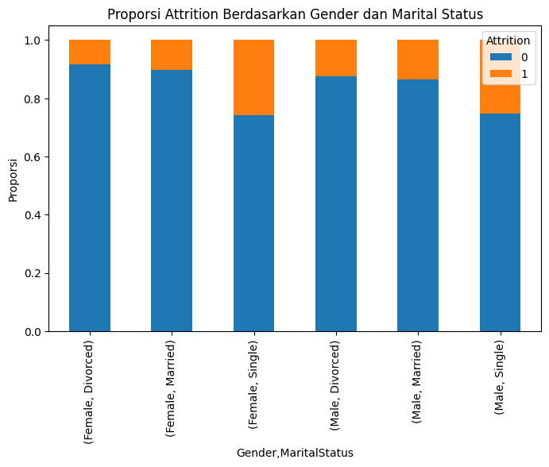

# Laporan Proyek Machine Learning  
## Prediksi Turnover Karyawan untuk Strategi Retensi SDM  
*Danella Citra Aldarena* — *5003231003*
*Maria Immaculata Dyah Hita Widowati* — *5003231027*
*Ruth Wahyu Sedjati Priyambodo* — *5003231129*

## **Domain Proyek: Turnover Karyawan**

Dalam era bisnis yang semakin kompetitif, pengelolaan sumber daya manusia menjadi faktor strategis dalam menjaga keberlanjutan dan daya saing perusahaan. Tingginya tingkat employee attrition atau turnover dapat menimbulkan konsekuensi serius seperti meningkatnya biaya rekrutmen, turunnya produktivitas, serta melemahnya moral tim kerja (Dessler, 2020). Oleh karena itu, perusahaan berupaya mengembangkan strategi manajemen yang mampu mempertahankan karyawan berprestasi agar tetap berkontribusi optimal terhadap organisasi.

Dataset yang digunakan dalam studi ini berisi informasi terkait profil karyawan, kondisi lingkungan kerja, serta status bertahan atau keluar dari perusahaan. Data tersebut mencakup berbagai variabel seperti demografi, jabatan, beban kerja, jam lembur, serta tingkat kepuasan kerja yang dapat memengaruhi keputusan karyawan untuk tetap bekerja atau mengundurkan diri (Han & Kang, 2022). Dataset ini relevan untuk pengembangan model prediktif yang bertujuan mengidentifikasi faktor-faktor penting yang berpengaruh terhadap keputusan karyawan meninggalkan perusahaan.

Kompetisi ini mendorong peserta untuk membangun model prediksi employee turnover, mengevaluasi fitur yang paling signifikan, dan menghasilkan wawasan strategis yang berguna bagi pengambilan keputusan manajemen. Selain itu, peserta juga dihadapkan pada tantangan ketidakseimbangan kelas, interaksi antarvariabel yang kompleks, serta pentingnya menjaga keseimbangan antara akurasi model dan interpretabilitas hasil agar solusi yang dihasilkan dapat diimplementasikan secara nyata (Choi et al., 2021).

**Referensi:**
[1] Choi, Y., Lee, S., & Kim, H. (2021). Predicting Employee Turnover Using Machine Learning Approaches. Journal of Human Resource Analytics, 8(2), 45–59.
[2] Dessler, G. (2020). Human Resource Management (16th ed.). Pearson Education.
[3] Han, J., & Kang, S. (2022). Understanding Factors Affecting Employee Retention: Evidence from HR Analytics. International Journal of Business and Management, 17(3), 112–126.

---

## Business Understanding

### Problem Statements  
Dalam dunia bisnis modern, sumber daya manusia (SDM) merupakan aset paling berharga yang menentukan daya saing dan keberlanjutan organisasi. Namun, banyak perusahaan menghadapi tantangan serius berupa tingginya tingkat employee turnover atau attrition. Fenomena ini dapat menyebabkan meningkatnya biaya rekrutmen, hilangnya pengetahuan institusional, penurunan produktivitas, serta dampak negatif terhadap moral karyawan yang tersisa (Dessler, 2020).

Berdasarkan latar belakang tersebut, berikut pernyataan masalah yang diangkat dalam proyek ini:

- **Pernyataan Masalah 1:** Apa saja faktor-faktor utama yang memengaruhi keputusan karyawan untuk keluar dari perusahaan?
- **Pernyataan Masalah 2:** Bagaimana membangun model prediksi yang mampu memperkirakan kemungkinan seorang karyawan akan melakukan turnover dengan akurasi tinggi?
- **Pernyataan Masalah 3:** Bagaimana hasil analisis ini dapat digunakan untuk merancang strategi retensi SDM yang efektif dan berbasis data?

### Goals  
Untuk menjawab permasalahan di atas, tujuan proyek ini dirumuskan sebagai berikut:

- **Tujuan 1:** Melakukan eksplorasi dan analisis terhadap data karyawan guna mengidentifikasi pola dan variabel yang berkontribusi terhadap employee turnover.
- **Tujuan 2:** Membangun model prediktif berbasis machine learning untuk menghitung probabilitas karyawan melakukan attrition.
- **Tujuan 3:** Memberikan rekomendasi strategis bagi departemen HR dalam mengurangi tingkat turnover dan meningkatkan kepuasan serta retensi karyawan berprestasi.

### Solution Statements  
Untuk mencapai tujuan tersebut, beberapa solusi yang akan diimplementasikan meliputi:

- **Eksperimen Berbagai Algoritma Klasifikasi:**  
  Mengembangkan dan membandingkan performa beberapa algoritma machine learning seperti:
    - Logistic Regression
    - Random Forest
    - Gradient Boosting
    - Extra Tree

- **Evaluasi Model dengan Metrik yang Relevan:**  
  Menggunakan metrik seperti:
    - Accuracy untuk mengukur ketepatan prediksi keseluruhan
    - Precision, Recall, dan F1-Score untuk menilai performa pada kelas “keluar”
    - ROC-AUC untuk menilai kemampuan model dalam membedakan antara karyawan yang bertahan dan keluar
    - Confusion Matrix untuk menginterpretasikan distribusi hasil prediksi

- **Analisis Fitur dan Visualisasi:**  
  Menggunakan feature importance, SHAP values, dan correlation heatmap untuk mengidentifikasi faktor-faktor paling berpengaruh terhadap turnover.

### Project Benefits  
Implementasi solusi ini diharapkan memberikan manfaat strategis bagi perusahaan, antara lain:

- **Penghematan Biaya:** Mengurangi kebutuhan perekrutan baru dengan mempertahankan karyawan yang ada.
- **Peningkatan Retensi Pelanggan:** Mengidentifikasi kelompok karyawan dengan risiko turnover tinggi untuk dilakukan intervensi preventif.
- **Peningkatan Pengalaman Pelanggan:** Membantu HR dalam merancang kebijakan kompensasi, beban kerja, dan program pengembangan karier berbasis data.
- **Pemasaran yang Lebih Efisien:** Menurunkan tingkat perputaran SDM sehingga tim kerja menjadi lebih solid dan berpengalaman.
- **Perlindungan Pendapatan:** Memberikan dasar analitis dalam perencanaan tenaga kerja jangka panjang (workforce planning).

---

## Data Understanding

### Sumber Data
Dataset yang digunakan dalam proyek ini diperoleh dari situs [Kaggle] (https://www.kaggle.com/competitions/tugas-1-sml-a-2025). Dataset ini berisi data terkait profil karyawan, kondisi kerja, dan status attrition (keluar atau tetap bekerja). Variabel-variabel yang tersedia mencakup usia, jabatan, departemen, jam lembur, kepuasan kerja, dan kompensasi, yang merepresentasikan berbagai aspek penting dalam manajemen sumber daya manusia.

Dataset ini terdiri dari ribuan data karyawan dengan jumlah kasus keluar yang relatif kecil, sehingga terdapat ketidakseimbangan kelas yang perlu ditangani dalam proses pemodelan. Data ini sangat berguna untuk membangun model prediktif yang mampu mengidentifikasi risiko turnover serta menemukan faktor-faktor kunci yang memengaruhi retensi karyawan di suatu perusahaan.

### Deskripsi Fitur
| No | Kolom                   | Non-Null Count  | Dtype  |
|----|--------------------------|-----------------|--------|
|  0 | id                      | 1176 non-null   | object |
|  1 | Age                     | 1176 non-null   | int64  |
|  2 | BusinessTravel          | 1176 non-null   | object |
|  3 | DailyRate               | 1176 non-null   | int64  |
|  4 | Department              | 1176 non-null   | object |
|  5 | DistanceFromHome        | 1176 non-null   | int64  |
|  6 | Education               | 1176 non-null   | int64  |
|  7 | EducationField          | 1176 non-null   | object |
|  8 | EmployeeCount           | 1176 non-null   | int64  |
|  9 | EmployeeNumber          | 1176 non-null   | int64  |
| 10 | EnvironmentSatisfaction | 1176 non-null   | int64  |
| 11 | Gender                  | 1176 non-null   | object |
| 12 | HourlyRate              | 1176 non-null   | int64  |
| 13 | JobInvolvement          | 1176 non-null   | int64  |
| 14 | JobLevel                | 1176 non-null   | int64  |
| 15 | JobRole                 | 1176 non-null   | object |
| 16 | JobSatisfaction         | 1176 non-null   | int64  |
| 17 | MaritalStatus           | 1176 non-null   | object |
| 18 | MonthlyIncome           | 1176 non-null   | int64  |
| .. | ...                     | ...             | ...    |
| 35 | Attrition               | 1176 non-null   | int64  |

### Penjelasan Fitur
- **id** - ID unik karyawan untuk identifikasi.
- **Age** - Usia karyawan.
- **BusinessTravel** - Frekuensi perjalanan dinas karyawan (contoh: Non-Travel, Travel_Rarely, Travel_Frequently).
- **DailyRate** - Gaji harian.
- **Department** - Departemen tempat karyawan bekerja (contoh: Sales, Research & Development, Human Resources).
- **DistanceFromHome** - Jarak tempat tinggal karyawan ke kantor.
- **Education** - Tingkat pendidikan terakhir: 1 = Below College, 2 = College, 3 = Bachelor, 4 = Master, 5 = Doctor.
- **EducationField** - Bidang studi terakhir karyawan (contoh: Life Sciences, Medical, Marketing).
- **EmployeeCount** - Jumlah karyawan (selalu 1 dalam dataset).
- **EmployeeNumber** - Nomor unik karyawan dalam sistem HR.
EnvironmentSatisfaction - Tingkat kepuasan terhadap lingkungan kerja: 1 = Low, 2 = Medium, 3 = High, 4 = Very High.
- **Gender** - Jenis kelamin karyawan (Male/Female).
- **HourlyRate** - Upah per jam.
- **JobInvolvement** - Tingkat keterlibatan pekerjaan: 1 = Low, 2 = Medium, 3 = High, 4 = Very High.
- **JobLevel** - Level jabatan karyawan.
- **JobRole** - Posisi/jabatan spesifik karyawan (contoh: Sales Executive, Research Scientist).
- **JobSatisfaction** - Tingkat kepuasan pekerjaan: 1 = Low, 2 = Medium, 3 = High, 4 = Very High.
- **MaritalStatus** - Status pernikahan karyawan (Single, Married, Divorced).
- **MonthlyIncome** - Gaji bulanan karyawan.
- **MonthlyRate** - Tarif bulanan karyawan.
- **NumCompaniesWorked** - Jumlah perusahaan tempat karyawan pernah bekerja sebelumnya.
- **Over18** - Status usia di atas 18 tahun (selalu Y dalam dataset).
- **OverTime** - Apakah karyawan sering lembur (Yes/No).
- **PercentSalaryHike** - Persentase kenaikan gaji tahunan terakhir.
- **PerformanceRating** - Penilaian kinerja terakhir: 1 = Low, 2 = Good, 3 = Excellent, 4 = Outstanding.
- **RelationshipSatisfactio**n - Tingkat kepuasan terhadap hubungan kerja: 1 = Low, 2 = Medium, 3 = High, 4 = Very High.
- **StandardHours** - Jam kerja standar (selalu 80 dalam dataset).
- **StockOptionLevel** - Level kepemilikan saham perusahaan.
- **TotalWorkingYears** - Total tahun pengalaman kerja.
- **TrainingTimesLastYear** - Jumlah pelatihan yang diikuti dalam setahun terakhir.
- **WorkLifeBalance** - Tingkat keseimbangan kerja–hidup: 1 = Bad, 2 = Good, 3 = Better, 4 = Best.
- **YearsAtCompany** - Total tahun bekerja di perusahaan saat ini.
- **YearsInCurrentRole** - Total tahun di posisi/jabatan saat ini.
- **YearsSinceLastPromotion** - Tahun sejak promosi terakhir.
- **YearsWithCurrManager** - Tahun bekerja dengan manajer saat ini.
- **Attrition** - Target: apakah karyawan keluar dari perusahaan (1 = Yes/ 0 = No).

### [Explanatory Data Analysis] - Analisis Target Variable: Attrition
<figure>
    

</figure>

Persentase tiap kelas Attrition (%):
Attrition
0    83.843537
1    16.156463
Name: proportion, dtype: float64

Terdapat class imbalance — kelas minoritas kurang dari 30% dari total data.
Pertimbangkan teknik balancing seperti SMOTE atau class_weight.

Grafik di atas menunjukkan distribusi variabel target Attrition, yang menggambarkan status apakah karyawan tetap bekerja (0) atau keluar dari perusahaan (1). Dari visualisasi tersebut terlihat bahwa sebagian besar karyawan berada pada kategori 0 (tidak keluar), dengan jumlah sekitar 1.000 orang, sedangkan karyawan yang keluar (1) hanya sekitar 200 orang. Hal ini menunjukkan bahwa tingkat attrition di perusahaan relatif rendah, yaitu sekitar 16–20% dari total karyawan.

Distribusi yang tidak seimbang ini menandakan adanya ketidakseimbangan kelas (imbalanced class) dalam data, di mana jumlah karyawan yang bertahan jauh lebih banyak dibandingkan dengan yang keluar. Kondisi ini penting untuk diperhatikan dalam proses pemodelan, karena algoritma machine learning dapat cenderung lebih fokus pada kelas mayoritas. Oleh karena itu, diperlukan penanganan khusus seperti penerapan teknik SMOTE, undersampling, atau penyesuaian class weight agar model dapat memprediksi kedua kelas secara lebih akurat.

### [Explanatory Data Analysis] - Status Pernikahan vs Attrition
<figure>
    

</figure>
Grafik di atas menunjukkan hubungan antara status pernikahan dan attrition (keluarnya karyawan dari perusahaan). Terlihat bahwa karyawan dengan status menikah (Married) memiliki jumlah paling banyak dan cenderung memiliki tingkat attrition yang rendah dibandingkan kelompok lain. Sementara itu, karyawan dengan status lajang (Single) memiliki proporsi attrition yang lebih tinggi dibandingkan dua kelompok lainnya, meskipun jumlah totalnya tidak sebanyak karyawan yang menikah. Adapun karyawan berstatus cerai (Divorced) memiliki jumlah paling sedikit dan juga menunjukkan tingkat attrition yang relatif rendah.

Secara umum, pola ini mengindikasikan bahwa status pernikahan dapat memengaruhi keputusan karyawan untuk tetap bekerja atau keluar dari perusahaan. Karyawan yang sudah menikah cenderung lebih stabil dan memiliki komitmen kerja yang lebih tinggi, sedangkan karyawan yang masih lajang mungkin lebih mudah berpindah pekerjaan karena faktor fleksibilitas dan pencarian peluang baru. Temuan ini dapat menjadi bahan pertimbangan bagi perusahaan untuk merancang strategi retensi yang berbeda sesuai dengan karakteristik demografis karyawan.

### [Explanatory Data Analysis] - Tingkat Pendidikan vs Attrition
<figure>
    

</figure>
Grafik di atas menunjukkan hubungan antara tingkat pendidikan dan attrition (keluarnya karyawan dari perusahaan). Terlihat bahwa sebagian besar karyawan memiliki tingkat pendidikan 3 dan 4, dengan mayoritas dari mereka tidak keluar dari perusahaan (attrition = 0). Sementara itu, karyawan dengan tingkat pendidikan 3 juga menjadi kelompok dengan jumlah attrition tertinggi dibandingkan tingkat pendidikan lainnya. Jumlah karyawan dengan tingkat pendidikan 1 dan 5 relatif lebih sedikit, dan keduanya memiliki tingkat attrition yang rendah.

Secara umum, grafik ini mengindikasikan bahwa attrition tidak hanya dipengaruhi oleh tingkat pendidikan, tetapi juga oleh faktor lain seperti posisi pekerjaan, gaji, atau peluang karier. Namun, terlihat bahwa kelompok dengan pendidikan menengah (tingkat 3) memiliki kecenderungan keluar yang lebih tinggi, kemungkinan karena mereka memiliki cukup keterampilan untuk mendapatkan peluang di tempat lain, namun belum mencapai stabilitas karier seperti mereka yang berpendidikan lebih tinggi. Temuan ini dapat membantu perusahaan dalam merancang strategi pengembangan karier dan retensi yang lebih sesuai berdasarkan latar belakang pendidikan karyawan.

### [Explanatory Data Analysis] - Gender vs Attrition
<figure>
    

</figure>
Grafik di atas memperlihatkan hubungan antara jenis kelamin (Gender) dan attrition (keluarnya karyawan dari perusahaan). Terlihat bahwa baik pada kelompok laki-laki (Male) maupun perempuan (Female), sebagian besar karyawan memilih untuk tetap bekerja (attrition = 0). Namun, jumlah karyawan laki-laki secara keseluruhan lebih tinggi dibandingkan perempuan. Selain itu, karyawan laki-laki juga memiliki jumlah attrition (1) yang sedikit lebih banyak dibandingkan perempuan.

Secara umum, hal ini menunjukkan bahwa jenis kelamin tidak memiliki pengaruh yang terlalu besar terhadap keputusan karyawan untuk keluar, meskipun laki-laki tampak sedikit lebih rentan terhadap attrition. Faktor lain seperti kepuasan kerja, posisi, atau beban kerja kemungkinan lebih berperan penting dibandingkan faktor gender dalam menentukan tingkat turnover di perusahaan.

### [Explanatory Data Analysis] - Hubungan antar variabel numerik berdasarkan Attrition
<figure>
    

</figure>
Grafik di atas menampilkan hubungan antar variabel numerik seperti Age, Monthly Income, Years at Company, dan Job Satisfaction terhadap status attrition (keluar atau tetap bekerja). Terlihat bahwa sebagian besar titik data berwarna biru (attrition = 0) mendominasi pada semua variabel, menandakan bahwa sebagian besar karyawan tetap bekerja. Sementara titik oranye (attrition = 1) tersebar dalam jumlah lebih sedikit, namun cenderung terkonsentrasi pada kelompok dengan usia muda, pendapatan lebih rendah, dan masa kerja yang lebih singkat.

Distribusi ini mengindikasikan bahwa karyawan muda dengan gaji rendah dan pengalaman kerja yang lebih sedikit cenderung memiliki kemungkinan lebih tinggi untuk keluar dari perusahaan. Sebaliknya, karyawan dengan pendapatan tinggi dan masa kerja lebih lama tampak lebih stabil. Untuk variabel Job Satisfaction, tidak tampak perbedaan mencolok antara kelompok yang keluar dan yang bertahan, sehingga faktor kepuasan kerja mungkin tidak menjadi pendorong utama attrition. Secara keseluruhan, grafik ini memberi gambaran bahwa faktor ekonomi (pendapatan) dan pengalaman kerja memiliki pengaruh yang lebih kuat terhadap tingkat attrition dibandingkan faktor usia atau kepuasan kerja semata.

### [Explanatory Data Analysis] - Hubungan antara Gender × MaritalStatus × Attrition.
<figure>
    

</figure>
Grafik di atas memperlihatkan proporsi attrition berdasarkan kombinasi gender dan status pernikahan. Terlihat bahwa baik pada karyawan laki-laki maupun perempuan, kelompok dengan status single memiliki proporsi attrition (warna oranye) yang lebih tinggi dibandingkan kelompok menikah atau cerai. Sementara itu, baik laki-laki maupun perempuan yang menikah menunjukkan tingkat attrition yang paling rendah, menandakan kecenderungan mereka untuk bertahan lebih lama di perusahaan.

Secara umum, pola ini menunjukkan bahwa status pernikahan memiliki pengaruh yang lebih kuat terhadap attrition dibandingkan gender. Karyawan yang masih lajang cenderung lebih mudah berpindah pekerjaan, kemungkinan karena tanggung jawab keluarga yang lebih ringan dan keinginan mencari pengalaman baru. Sebaliknya, karyawan yang sudah menikah atau pernah menikah cenderung memiliki stabilitas kerja yang lebih tinggi. Temuan ini dapat menjadi dasar bagi perusahaan untuk menyesuaikan strategi retensi karyawan dengan memperhatikan faktor demografis seperti status pernikahan.

### [Explanatory Data Analysis] - Korelasi antar Variabel Numerik (Age, MonthlyIncome, YearsAtCompany, JobSatisfaction)
<figure>
    

</figure>
Berdasarkan heatmap korelasi antar variabel numerik di atas, terlihat bahwa terdapat hubungan positif sedang antara Age dengan MonthlyIncome (r = 0.51) serta antara MonthlyIncome dengan YearsAtCompany (r = 0.50). Artinya, semakin tinggi usia atau semakin lama seseorang bekerja di perusahaan, umumnya pendapatan bulanannya juga meningkat. Selain itu, Age dan YearsAtCompany memiliki korelasi positif rendah (r = 0.31), yang menunjukkan bahwa karyawan yang lebih tua cenderung memiliki masa kerja lebih panjang, meskipun hubungan ini tidak terlalu kuat.

Sementara itu, JobSatisfaction tidak menunjukkan korelasi berarti dengan variabel lain (nilai korelasi mendekati 0), baik terhadap usia, pendapatan, maupun lama bekerja. Hal ini mengindikasikan bahwa tingkat kepuasan kerja karyawan tidak bergantung pada faktor demografis maupun finansial secara langsung, melainkan kemungkinan dipengaruhi oleh aspek lain seperti lingkungan kerja, budaya organisasi, atau hubungan dengan atasan dan rekan kerja.

### [Explanatory Data Analysis] - Distribusi Income per JobRole Berdasarkan Attrition
<figure>
    

</figure>
Grafik violin di atas menunjukkan distribusi pendapatan bulanan (MonthlyIncome) berdasarkan jenis pekerjaan (JobRole) dan status attrition (keluar atau tidak). Secara umum, posisi seperti Manager dan Research Director memiliki pendapatan jauh lebih tinggi dibandingkan peran lain, dengan median gaji yang terlihat di atas 15.000. Sementara itu, posisi seperti Sales Representative, Laboratory Technician, dan Research Scientist memiliki pendapatan yang relatif rendah dengan median di bawah 5.000.

Dari segi attrition, terlihat bahwa distribusi pendapatan antara karyawan yang keluar (warna oranye) dan bertahan (warna biru) tidak berbeda secara signifikan pada sebagian besar peran. Namun, pada beberapa posisi seperti Sales Representative dan Human Resources, karyawan yang keluar cenderung memiliki rentang pendapatan yang sedikit lebih rendah dibandingkan yang bertahan. Hal ini mengindikasikan bahwa tingkat pendapatan mungkin berperan kecil dalam keputusan keluar, tetapi bukan faktor utama; faktor lain seperti kepuasan kerja, peluang karier, atau tekanan pekerjaan kemungkinan memiliki pengaruh lebih besar.

## Data Preparation

### 1. Duplikasi Data
|  No   |  Null |
|--------|-------|
|   0    | False |
|   1    | False |
|   2    | False |
|   3    | False |
|   4    | False |
|  ...   |  ...  |
| 1171   | False |
| 1172   | False |
| 1173   | False |
| 1174   | False |
| 1175   | False |

### 2. Check Missing Value
| Kolom                      | Jumlah Missing |
|-----------------------------|----------------|
| id                          | 0              |
| Age                         | 0              |
| BusinessTravel              | 0              |
| DailyRate                   | 0              |
| Department                  | 0              |
| DistanceFromHome            | 0              |
| Education                   | 0              |
| EducationField              | 0              |
| EmployeeCount               | 0              |
| EmployeeNumber              | 0              |
| EnvironmentSatisfaction     | 0              |
| Gender                      | 0              |
| HourlyRate                  | 0              |
| JobInvolvement              | 0              |
| JobLevel                    | 0              |
| JobRole                     | 0              |
| JobSatisfaction             | 0              |
| MaritalStatus               | 0              |
| MonthlyIncome               | 0              |
| MonthlyRate                 | 0              |
| NumCompaniesWorked          | 0              |
| Over18                      | 0              |
| OverTime                    | 0              |
| PercentSalaryHike           | 0              |
| PerformanceRating           | 0              |
| YearsInCurrentRole          | 0              |
| YearsSinceLastPromotion     | 0              |
| YearsWithCurrManager        | 0              |
| Attrition                   | 0              |

### 3. Memisahkan fitur X dan fitur Y

### 4. Menghapus kolom yang konstan
Removed: ['EmployeeCount', 'Over18', 'StandardHours']

Kolom `EmployeeCount`, `Over18`, dan `StandardHours` memiliki satu nilai unik di seluruh baris.  
Kolom seperti ini tidak memberikan informasi apa pun bagi model, sehingga dihapus dari dataset agar model lebih efisien.

### 5. Encoding Kategorikal

### 6. Feature Engineering
=== Feature Engineering Comparison ===
Original features: 31
Improved version features: 55
 No  | Nama Fitur Baru          
-----|--------------------------
  1  | AvgSatisfaction         
  2  | HighRisk_Flag           
  3  | ExperienceRatio         
  4  | PoorWorkLife            
  5  | Income_JobLevel         
  6  | LowJobLevel             
  7  | CurrentRoleRatio        
  8  | TrainingPerYear         
  9  | Age_Experience          
 10  | LongCommute             
 11  | JobHoppingRate          
 12  | Career_Stagnation       
 13  | IncomePerYear           
 14  | PromotionStagnationRatio
 15  | Satisfaction_Performance
 16  | ManagerStability        
 17  | TimeWithoutPromotion    
 18  | IncomePerAge            
 19  | Monthly_vs_Daily_Rate   
 20  | ShortTenure             
 21  | OverTime_Binary         
 22  | LowSatisfaction         
 23  | IsYoung                 
 24  | AttritionRiskScore      

Jumlah fitur meningkat dari 31 fitur menjadi 5 fitur.

### 7. Feature Selection
Top 20 Feature Importance
 No   | Feature                  | Importance
------|--------------------------|------------
  1   | AttritionRiskScore       | 0.073536
  2   | Age_Experience           | 0.052724
  3   | JobHoppingRate           | 0.041741
  4   | Income_JobLevel          | 0.040687
  5   | MonthlyIncome            | 0.038546
  6   | Age                      | 0.037908
  7   | TotalWorkingYears        | 0.036749
  8   | IncomePerYear            | 0.029555
  9   | DailyRate                | 0.026961
 10   | OverTime                 | 0.026755
 11   | AvgSatisfaction          | 0.026377
 12   | Monthly_vs_Daily_Rate    | 0.025543
 13   | Satisfaction_Performance | 0.025139
 14   | OverTime_Binary          | 0.024850
 15   | EmployeeNumber           | 0.023789
 16   | HourlyRate               | 0.023449
 17   | DistanceFromHome         | 0.023369
 18   | StockOptionLevel         | 0.023308
 19   | MonthlyRate              | 0.023107
 20   | IncomePerAge             | 0.022643

<figure>
    

</figure>

## Model Training, Comparison, Selection

### 1. CV-aware Incremental Feature Selection
| No | Feature                  | Keterangan & Nilai CV ROC AUC                |
|----|---------------------------|---------------------------------------------|
|  1 | AttritionRiskScore        | Added: CV ROC AUC = 0.7488                 |
|  2 | Age_Experience            | Skipped: CV ROC AUC would drop to 0.7459   |
|  3 | JobHoppingRate            | Added: CV ROC AUC = 0.7499                 |
|  4 | Income_JobLevel           | Skipped: CV ROC AUC would drop to 0.6714   |
|  5 | MonthlyIncome             | Skipped: CV ROC AUC would drop to 0.6983   |
|  6 | Age                       | Added: CV ROC AUC = 0.7715                 |
|  7 | TotalWorkingYears         | Added: CV ROC AUC = 0.7759                 |
|  8 | IncomePerYear             | Skipped: CV ROC AUC would drop to 0.7583   |
|  9 | DailyRate                 | Skipped: CV ROC AUC would drop to 0.7670   |
| 10 | OverTime                  | Added: CV ROC AUC = 0.7760                 |
| 11 | AvgSatisfaction           | Added: CV ROC AUC = 0.7973                 |
| 12 | Monthly_vs_Daily_Rate     | Skipped: CV ROC AUC would drop to 0.7930   |
| 13 | Satisfaction_Performance  | Skipped: CV ROC AUC would drop to 0.7971   |
| 14 | OverTime_Binary           | Added: CV ROC AUC = 0.7973                 |
| 15 | EmployeeNumber            | Skipped: CV ROC AUC would drop to 0.7625   |
| 16 | HourlyRate                | Skipped: CV ROC AUC would drop to 0.7931   |
| 17 | DistanceFromHome          | Added: CV ROC AUC = 0.7986                 |
| 18 | StockOptionLevel          | Added: CV ROC AUC = 0.8101                 |
| 19 | MonthlyRate               | Skipped: CV ROC AUC would drop to 0.6518   |
| 20 | IncomePerAge              | Skipped: CV ROC AUC would drop to 0.7930   |
| 21 | YearsAtCompany            | Skipped: CV ROC AUC would drop to 0.8061   |
| 22 | TrainingPerYear           | Skipped: CV ROC AUC would drop to 0.8083   |
| 23 | ManagerStability          | Added: CV ROC AUC = 0.8116                 |
| 24 | ExperienceRatio           | Skipped: CV ROC AUC would drop to 0.8092   |
| 25 | JobRole                   | Added: CV ROC AUC = 0.8119                 |
| 26 | EnvironmentSatisfaction   | Skipped: CV ROC AUC would drop to 0.8069   |
| 27 | JobInvolvement            | Added: CV ROC AUC = 0.8170                 |
| 28 | CurrentRoleRatio          | Skipped: CV ROC AUC would drop to 0.8161   |
| 29 | PercentSalaryHike         | Skipped: CV ROC AUC would drop to 0.8159   |
| 30 | PromotionStagnationRatio  | Added: CV ROC AUC = 0.8200                 |
| 31 | NumCompaniesWorked        | Skipped: CV ROC AUC would drop to 0.8181   |
| 32 | MaritalStatus             | Skipped: CV ROC AUC would drop to 0.8197   |
| 33 | YearsWithCurrManager      | Skipped: CV ROC AUC would drop to 0.8184   |
| 34 | WorkLifeBalance           | Skipped: CV ROC AUC would drop to 0.8180   |
| 35 | JobSatisfaction           | Skipped: CV ROC AUC would drop to 0.8191   |
| 36 | RelationshipSatisfaction  | Skipped: CV ROC AUC would drop to 0.8191   |
| 37 | TrainingTimesLastYear     | Skipped: CV ROC AUC would drop to 0.8197   |
| 38 | EducationField            | Skipped: CV ROC AUC would drop to 0.8198   |
| 39 | YearsSinceLastPromotion   | Added: CV ROC AUC = 0.8204                 |
| 40 | YearsInCurrentRole        | Skipped: CV ROC AUC would drop to 0.8194   |
| 41 | Education                 | Skipped: CV ROC AUC would drop to 0.8191   |
| 42 | JobLevel                  | Skipped: CV ROC AUC would drop to 0.8190   |
| 43 | ShortTenure               | Added: CV ROC AUC = 0.8231                 |
| 44 | Department                | Added: CV ROC AUC = 0.8234                 |
| 45 | IsYoung                   | Skipped: CV ROC AUC would drop to 0.8221   |
| 46 | BusinessTravel            | Skipped: CV ROC AUC would drop to 0.8220   |
| 47 | HighRisk_Flag             | Added: CV ROC AUC = 0.8236                 |
| 48 | LowJobLevel               | Added: CV ROC AUC = 0.8311                 |
| 49 | Gender                    | Skipped: CV ROC AUC would drop to 0.8293   |
| 50 | PoorWorkLife              | Skipped: CV ROC AUC would drop to 0.8298   |
| 51 | LongCommute               | Skipped: CV ROC AUC would drop to 0.8304   |
| 52 | PerformanceRating         | Skipped: CV ROC AUC would drop to 0.8308   |
| 53 | LowSatisfaction           | Skipped: CV ROC AUC would drop to 0.8311   |
| 54 | TimeWithoutPromotion      | Skipped: CV ROC AUC would drop to 0.8309   |
| 55 | Career_Stagnation         | Skipped: CV ROC AUC would drop to 0.8298   |

### 2. Train Validasi Split
Memisahkan data menjadi data training (80%) dan validation (20%) dan lakukan standarisasi

Train: (940, 18), Val: (236, 18)

### 3. Class Balancing

Using class_weight='balanced'

### 4. Analisis Model

SECTION 7 : MODEL TRAINING
| Model             |  Train   |   Val    |    CV    |   Gap   | Evaluasi |
|-------------------|----------|----------|----------|---------|----------|
| Logistic L2       | 0.8470   | 0.8207   | 0.8266   | 0.0263  | GOOD     |
| Logistic L1       | 0.8442   | 0.8192   | 0.8231   | 0.0250  | GOOD     |
| Random Forest     | 0.9276   | 0.7968   | 0.8045   | 0.1308  | BAD      |
| Extra Trees       | 0.8845   | 0.8276   | 0.8020   | 0.0569  | WARN     |
| Gradient Boosting | 0.9795   | 0.8037   | 0.8160   | 0.1758  | BAD      |

SECTION 8 : COMPARISON
| Model             |  Train   |   Val    |    CV    |   Gap    |
|-------------------|----------|----------|----------|----------|
| Logistic L2       | 0.847048 | 0.820707 | 0.826574 | 0.026341 |
| Logistic L1       | 0.844234 | 0.819245 | 0.823094 | 0.024989 |
| Gradient Boosting | 0.979537 | 0.803695 | 0.815984 | 0.175842 |
| Random Forest     | 0.927615 | 0.796784 | 0.804485 | 0.130831 |
| Extra Trees       | 0.884476 | 0.827618 | 0.801958 | 0.056858 |

SECTION 9: CALIBRATION                                                      
| Model          | Original | Calibrated | Gain     |
|----------------|-----------|------------|----------|
| Logistic L1    | 0.8192    | 0.8125     | -0.0067  |
| Logistic L2    | 0.8207    | 0.8196     | -0.0011  |
| Extra Trees    | 0.8276    | 0.8351     | +0.0075  |

SECTION 10: ENSEMBLE         
Linear: Logistic L2, Tree: Gradient Boosting
Ensemble: ['Logistic L2', 'Gradient Boosting', 'Logistic L2 (Cal)']
| Metric    |   Score  |
|------------|----------|
| Average    | 0.8216   |
| Weighted   | 0.8215   |
| Best       | 0.8216   |
| Gain       | -0.0060  |

SECTION 11: TEST PREDICTIONS                                                 
| Model              | Test Score |
|--------------------|-------------|
| Logistic L2        | 0.3889      |
| Gradient Boosting  | 0.1535      |
| Logistic L2 (Cal)  | 0.1664      |
|--------------------|-------------|
| Final Prediction   | 0.2368      |
| Train Score        | 0.1616      |
| Difference (Δ)     | 0.0753      |

SECTION 12: SUBMISSION                                                       
Created: submission.csv
| Statistic |  Value  |
|------------|---------|
| Mean       | 0.2368  |
| Std        | 0.2090  |
| Min        | 0.0117  |
| Max        | 0.9612  |

|     id    | Attrition  |
|------------|------------|
| CM617      | 0.529213   |
| PJ010      | 0.061832   |
| GJ831      | 0.281729   |
| JD352      | 0.050992   |
| WZ263      | 0.525857   |
| OD346      | 0.220390   |
| GF698      | 0.066929   |
| JK198      | 0.110908   |
| SP276      | 0.051216   |
| OP259      | 0.849579   |
| CR707      | 0.315025   |
| HO168      | 0.232425   |
| CX146      | 0.116768   |
| NV992      | 0.355532   |
| FB734      | 0.223980   |
| XV265      | 0.778754   |
| IK137      | 0.061223   |
| NQ433      | 0.063211   |
| EJ758      | 0.612505   |
| LZ264      | 0.097098   |

CV: 0.8266, Val: 0.8276, Ensemble: 0.8216
Files: submission.csv + 5 PNG visualizations

SECTION 13: BEST MODEL EVALUATION  
| Class         | Precision | Recall | F1-Score | Support |
|----------------|------------|---------|-----------|----------|
| 0 (No Attrition) | 0.9158     | 0.9343  | 0.9250    | 198      |
| 1 (Attrition)    | 0.6176     | 0.5526  | 0.5833    | 38       |
|                  |            |         |           |          |
| Accuracy         |            |         | 0.8729    | 236      |
| Macro Avg        | 0.7667     | 0.7435  | 0.7542    | 236      |
| Weighted Avg     | 0.8678     | 0.8729  | 0.8700    | 236      |

ROC-AUC Score : 0.8216
PR-AUC Score  : 0.6284

| MODEL SAVED                                                                 |
|------------------------------------------------------------------------------|
| ✅ Ensemble model saved at: D:/SML_A/model/ensemble_L2_GB_Cal_v1.pkl         |

SECTION 14: VISUALIZATION                                                    |
<figure>
    

</figure>
<figure>
    

</figure>
<figure>
    

</figure>

## Model Interpretation

Model terbaik yang dihasilkan merupakan model ensemble yang menggabungkan Logistic Regression dengan regularisasi L2, Gradient Boosting, dan Logistic L2 yang telah dikalibrasi. Model ini menunjukkan performa yang cukup baik dengan akurasi 87,29%, yang berarti sebagian besar prediksi sudah sesuai dengan kondisi aktual. Untuk kelas karyawan yang keluar (attrition = 1), precision sebesar 0.6176 menunjukkan bahwa sekitar 62% prediksi keluar benar-benar tepat, sementara recall sebesar 0.5526 menunjukkan bahwa model mampu mengenali sekitar 55% dari seluruh karyawan yang benar-benar keluar. Nilai F1-score sebesar 0.5833 menandakan keseimbangan yang moderat antara ketepatan dan kelengkapan deteksi. Selain itu, ROC-AUC sebesar 0.8216 dan PR-AUC sebesar 0.6284 menunjukkan bahwa model memiliki kemampuan diskriminasi yang baik dalam membedakan karyawan yang bertahan dan keluar, meskipun datanya tidak seimbang.

## Model Implementation

Secara bisnis, hasil prediksi model ini juga memberikan gambaran nilai finansial yang signifikan. Berdasarkan confusion matrix, terdapat 21 karyawan yang berhasil diprediksi dengan benar akan keluar (True Positive), 17 karyawan yang keluar tetapi tidak terdeteksi (False Negative), serta 13 karyawan yang sebenarnya bertahan tetapi diprediksi keluar (False Positive). Dengan asumsi bahwa biaya kehilangan satu karyawan akibat turnover adalah Rp25 juta, maka potensi kerugian yang berhasil dihindari dari 21 True Positive adalah sebesar 21 × Rp25 juta = Rp525 juta. Sementara itu, 17 karyawan yang keluar tetapi tidak terdeteksi menimbulkan kerugian sebesar 17 × Rp25 juta = Rp425 juta. Di sisi lain, untuk 13 karyawan yang salah diprediksi keluar, diasumsikan perusahaan mengeluarkan biaya retensi sebesar Rp5 juta per orang, sehingga totalnya mencapai 13 × Rp5 juta = Rp65 juta. Setelah dikalkulasi secara keseluruhan, model ini memberikan dampak finansial bersih sebesar Rp35 juta (Rp525 juta – Rp425 juta – Rp65 juta).

Hasil ini menunjukkan bahwa model tidak hanya memiliki performa statistik yang solid, tetapi juga berdampak positif terhadap efisiensi biaya perusahaan. Dengan menggunakan model ini, perusahaan dapat mengantisipasi potensi turnover dengan lebih tepat dan menyalurkan strategi retensi secara lebih efektif, sehingga mampu mengoptimalkan anggaran dan menjaga stabilitas tenaga kerja.

